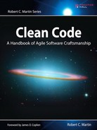

# Clean Code 中文

  

## 序

## 目录

- [第 1 章 整洁代码](ch1.md)
- [第 2 章 有意义的命名](ch2.md)
- [第 3 章 函数](ch3.md)
- [第 4 章 注释](ch4.md)
- [第 5 章 格式](ch5.md)
- [第 6 章 对象和数据结构](ch6.md)
- [第 7 章 错误处理](ch7.md)
- [第 8 章 边界](ch8.md)
- [第 9 章 单元测试](ch9.md)
- [第 10 章 类](ch10.md)
- [第 11 章 系统](ch11.md)
- [第 12 章 迭进](ch12.md)
- [第 13 章 并发编程](ch13.md)
- [第 14 章 逐步改进](ch14.md)
- [第 15 章 JUnit 内幕](ch15.md)
- [第 16 章 重构 SerialDate](ch16.md)
- [第 17 章 味道与启发](ch17.md)
- [附录 A 并发编程 II](apA.md)
